# v7 포인트 이벤트 시스템 — 전체 흐름 및 플로차트

> **최종 업데이트**: 2026-03-14
> **관련 문서**: [v7-point.md](../v7-point.md) | [v7-event-overview.md](v7-event-overview.md) | [v7-event-coupon.md](v7-event-coupon.md) | [v7-event.md](../api/v7-event.md)

---

## 목차

1. [시스템 개요](#1-시스템-개요)
2. [전체 아키텍처 플로차트](#2-전체-아키텍처-플로차트)
3. [글/코멘트 포인트 이벤트](#3-글코멘트-포인트-이벤트)
4. [스피닝 휠 이벤트](#4-스피닝-휠-이벤트)
5. [QR 코드 삼단콤보](#5-qr-코드-삼단콤보)
6. [쿠폰 관리 시스템](#6-쿠폰-관리-시스템)
7. [포인트 레벨 시스템](#7-포인트-레벨-시스템)
8. [DB 테이블 관계도](#8-db-테이블-관계도)
9. [API 엔드포인트 매트릭스](#9-api-엔드포인트-매트릭스)
10. [관리자/사용자 페이지 맵](#10-관리자사용자-페이지-맵)
11. [안티치트 및 보안](#11-안티치트-및-보안)

---

## 1. 시스템 개요

필고 포인트 이벤트 시스템은 **3개의 독립적인 서브시스템**으로 구성된다:

| 서브시스템 | 설명 | 포인트 범위 | 트리거 |
|-----------|------|------------|--------|
| **글/코멘트 포인트 이벤트** | 이벤트 기간에 글/코멘트 작성 시 랜덤 배율 포인트 지급 | 15P ~ 200배 | 글/코멘트 생성 |
| **스피닝 휠 이벤트** | 200P 소비 → 10개 섹션 가중치 기반 확률 보상 | 0P ~ 2,000P + 쿠폰 | 사용자 직접 참여 |
| **QR 코드 삼단콤보** | QR 스캔 → 재방문 추첨 → 후기 작성 → 포인트 적립 | 기본 + 2,000~3,000P | QR 코드 스캔 |

---

## 2. 전체 아키텍처 플로차트

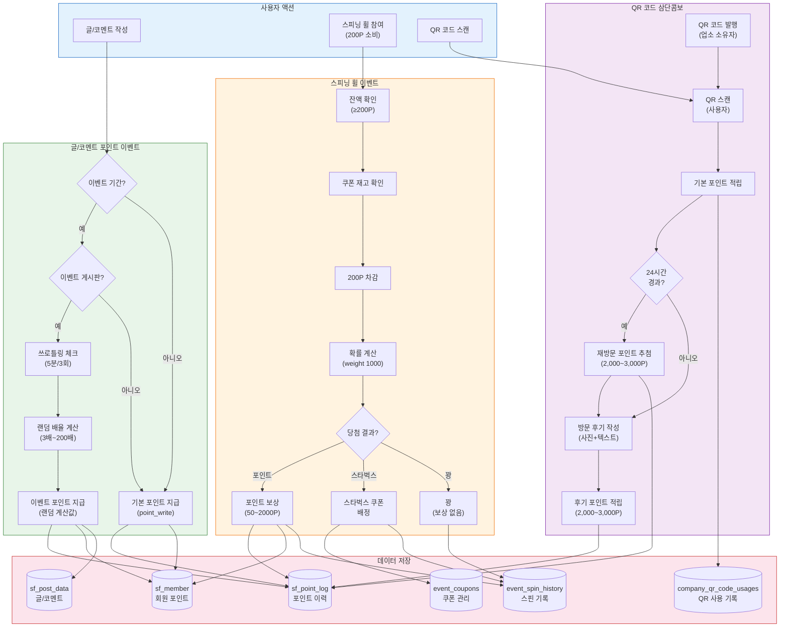

---

## 3. 글/코멘트 포인트 이벤트

### 3.1 전체 흐름

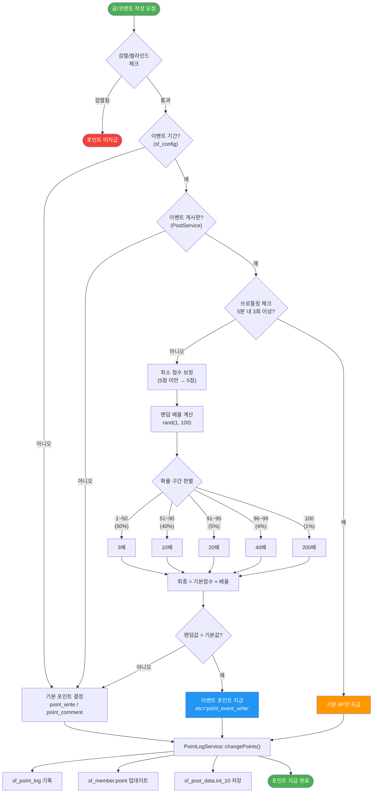

### 3.2 배율 확률표

| 확률 구간 | 확률 | 배율 | 예시 (기본 70P) |
|----------|------|------|-----------------|
| 1~50 | 50% | 3배 | 210P |
| 51~90 | 40% | 10배 | 700P |
| 91~95 | 5% | 20배 | 1,400P |
| 96~99 | 4% | 40배 | 2,800P |
| 100 | 1% | 200배 | 14,000P |

### 3.3 핵심 코드 호출 체인

```
PostService::create()
  → increasePointsForCreate($post, $member)
    → getEventPoints($config, $post)
      → SettingsService::isInPointEventDate()     // 이벤트 기간 확인
      → PostService::getEventPostIdsPublic()      // 이벤트 게시판 확인
      → PointLogService::getRecentActionCount()   // 쓰로틀링 체크
      → randomizeEventPoint($score)               // 랜덤 배율 계산
    → changeUserPoints()
      → PointLogService::changePoints()           // 포인트 변경 + 로그 기록
```

### 3.4 이벤트 기간 관리

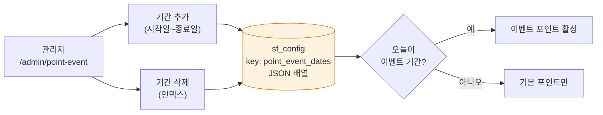

**sf_config 저장 형식:**
```json
[
  {"start": 20260315, "end": 20260320},
  {"start": 20260401, "end": 20260410}
]
```

### 3.5 삭제 시 포인트 회수

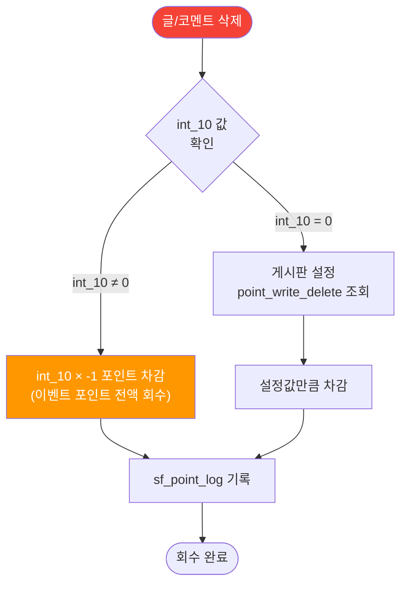

---

## 4. 스피닝 휠 이벤트

### 4.1 전체 흐름

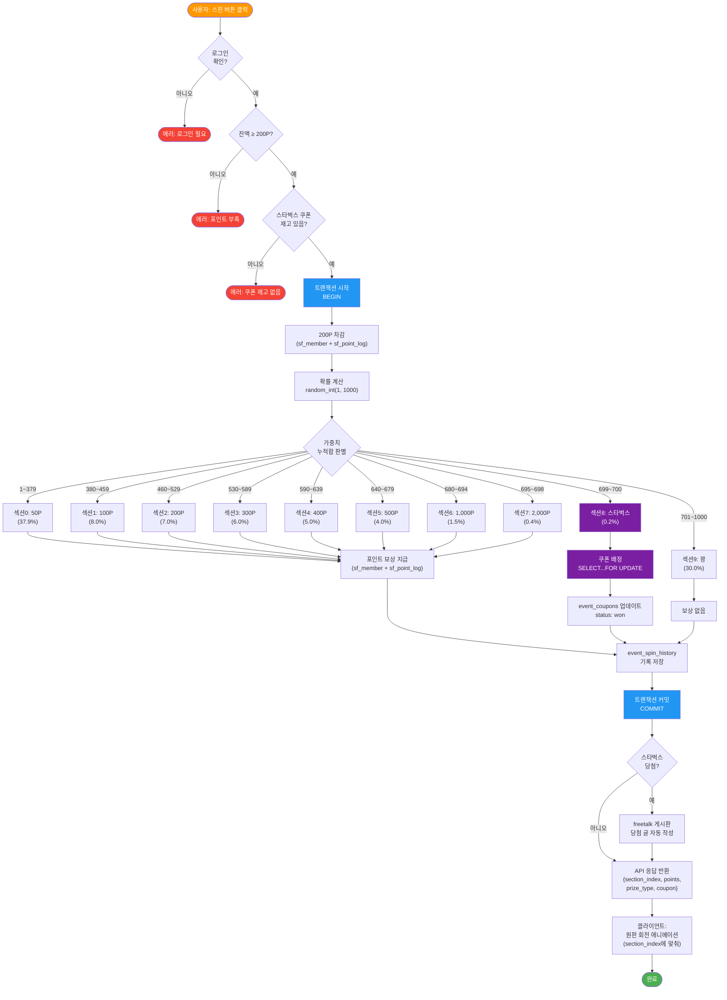

### 4.2 확률 분포표

| 섹션 | 보상 | Weight | 확률 | 쿠폰 소진 시 |
|------|------|--------|------|-------------|
| 0 | 50P | 379 | 37.9% | **381** (37.9% + 0.2%) |
| 1 | 100P | 80 | 8.0% | 80 |
| 2 | 200P | 70 | 7.0% | 70 |
| 3 | 300P | 60 | 6.0% | 60 |
| 4 | 400P | 50 | 5.0% | 50 |
| 5 | 500P | 40 | 4.0% | 40 |
| 6 | 1,000P | 15 | 1.5% | 15 |
| 7 | 2,000P | 4 | 0.4% | 4 |
| 8 | **스타벅스** | **2** | **0.2%** | **0** (50P에 합산) |
| 9 | 꽝 | 300 | 30.0% | 300 |
| **합계** | | **1000** | **100%** | **1000** |

### 4.3 동적 확률 전환 흐름

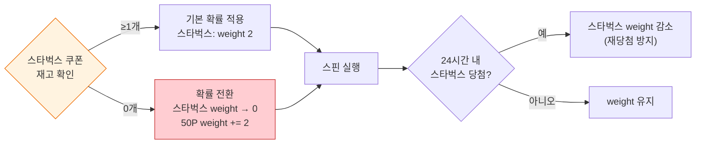

### 4.4 트랜잭션 시퀀스

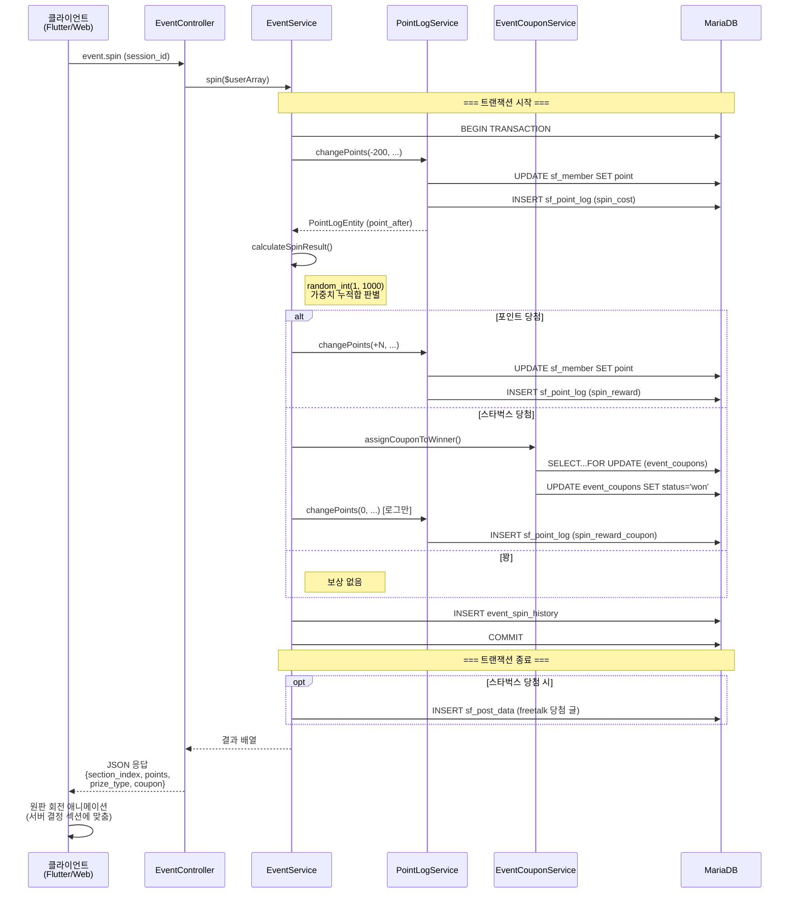

---

## 5. QR 코드 삼단콤보

### 5.1 전체 흐름

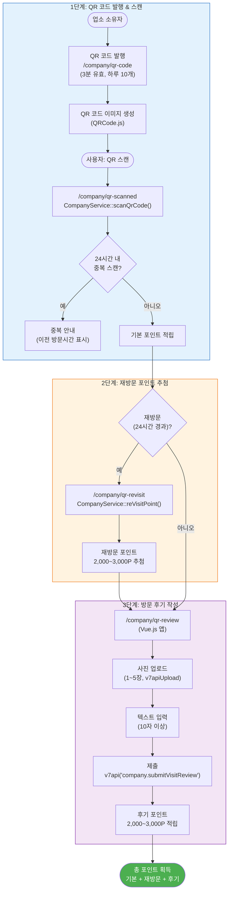

### 5.2 QR 코드 생명주기

```mermaid
stateDiagram-v2
    [*] --> active: QR 코드 발행<br/>(CompanyService::issueQrCode)
    active --> used: 사용자 스캔<br/>(scanQrCode)
    active --> expired: 3분 경과<br/>(타이머 만료)
    active --> disabled: 관리자 비활성화
    used --> [*]
    expired --> [*]
    disabled --> active: 관리자 재활성화
```

---

## 6. 쿠폰 관리 시스템

### 6.1 쿠폰 상태 전환

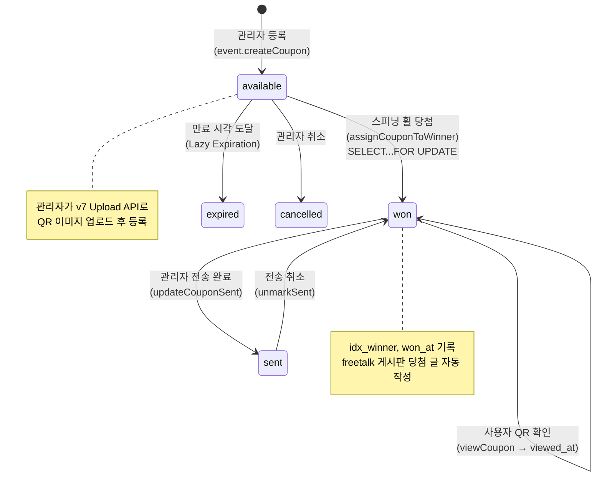

### 6.2 쿠폰 등록 → 당첨 → 전송 흐름

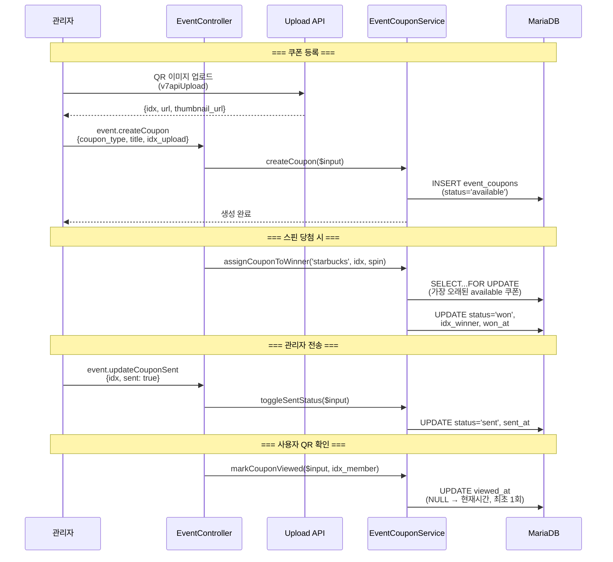

---

## 7. 포인트 레벨 시스템

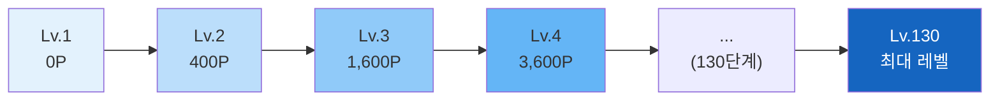

**레벨 진행률 계산**:
```
level_progress = (현재포인트 - 현재레벨기준) / (다음레벨기준 - 현재레벨기준) × 100
```

---

## 8. DB 테이블 관계도

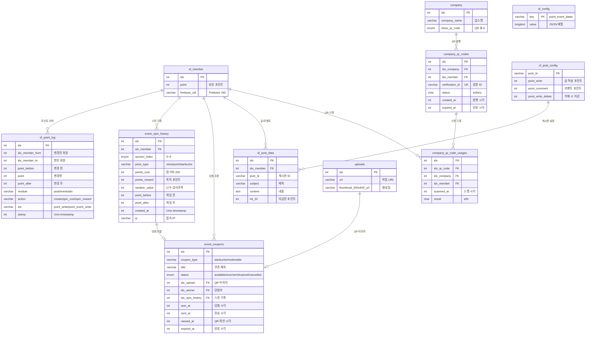

---

## 9. API 엔드포인트 매트릭스

### 스피닝 휠 API

| API method | HTTP | 인증 | 설명 | Service 메서드 |
|------------|------|------|------|---------------|
| `event.spin` | GET/POST | 로그인 | 스핀 실행 (200P 차감) | `EventService::spin()` |
| `event.history` | GET | 로그인 | 스핀 히스토리 | `EventService::getHistory()` |

### 쿠폰 API

| API method | HTTP | 인증 | 설명 | Service 메서드 |
|------------|------|------|------|---------------|
| `event.myCoupons` | GET | 로그인 | 내 당첨 쿠폰 | `EventCouponService::getCouponListForAdmin()` |
| `event.viewCoupon` | GET | 로그인 | 쿠폰 QR 확인 | `EventCouponService::markCouponViewed()` |
| `event.createCoupon` | POST | 관리자 | 쿠폰 생성 | `EventCouponService::createCoupon()` |
| `event.deleteCoupon` | POST | 관리자 | 쿠폰 삭제 | `EventCouponService::deleteCoupon()` |
| `event.updateCoupon` | POST | 관리자 | 쿠폰 수정 | `EventCouponService::updateCoupon()` |
| `event.updateCouponSent` | POST | 관리자 | 전송 상태 토글 | `EventCouponService::toggleSentStatus()` |
| `event.listCoupons` | GET | 관리자 | 쿠폰 목록 | `EventCouponService::getCouponListForAdmin()` |
| `event.couponStats` | GET | 관리자 | 쿠폰 통계 | `EventCouponService::getStatsSummary()` |

### 포인트 로그 API

| API method | HTTP | 인증 | 설명 | Service 메서드 |
|------------|------|------|------|---------------|
| `pointLog.history` | GET | 로그인 | 포인트 히스토리 | `PointLogService::getHistory()` |
| `pointLog.get` | GET | 로그인 | 로그 단건 조회 | `PointLogService::getLog()` |

### QR 코드 API (CompanyController 경유)

| API method | HTTP | 인증 | 설명 |
|------------|------|------|------|
| `company.issueQrCode` | POST | 업소 소유자 | QR 코드 발행 |
| `company.scanQrCode` | POST | 선택 | QR 코드 스캔 |
| `company.reVisitPoint` | POST | 로그인 | 재방문 포인트 추첨 |
| `company.submitVisitReview` | POST | 로그인 | 방문 후기 제출 |

---

## 10. 관리자/사용자 페이지 맵

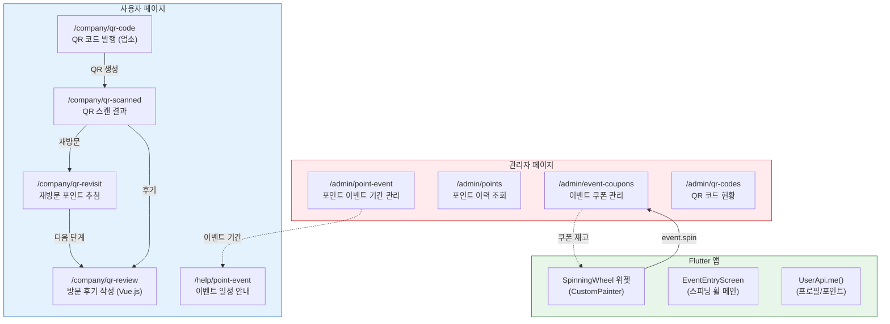

### 페이지별 상세

| 페이지 | 파일 경로 | 렌더링 | 주요 Service 호출 |
|--------|----------|--------|------------------|
| 이벤트 기간 관리 | `v7/admin/point-event.php` | SSR | `SettingsService::addPointEventDate()` |
| 포인트 이력 | `v7/admin/points.php` | SSR | `PointLogService::getHistory()` |
| 쿠폰 관리 | `v7/admin/event-coupons.php` | SSR | `EventCouponService::getCouponListForAdmin()` |
| QR 현황 | `v7/admin/qr-codes.php` | SSR | `QrCodeRepository` |
| 이벤트 안내 | `v7/help/point-event.php` | SSR | `SettingsService::getPointEventDates()` |
| QR 발행 | `v7/company/qr-code.php` | SSR | `CompanyService::issueQrCode()` |
| QR 스캔 결과 | `v7/company/qr-scanned.php` | SSR | `CompanyService::scanQrCode()` |
| 재방문 추첨 | `v7/company/qr-revisit.php` | SSR | `CompanyService::reVisitPoint()` |
| 후기 작성 | `v7/company/qr-review.php` | SSR+CSR | `v7api('company.submitVisitReview')` |

---

## 11. 안티치트 및 보안

### 11.1 보안 메커니즘 요약

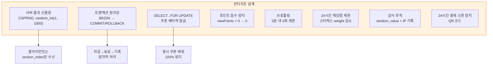

### 11.2 스피닝 휠 안티치트

| 위협 | 방어 메커니즘 |
|------|-------------|
| 클라이언트 결과 조작 | 서버에서 100% 결과 결정, 클라이언트는 애니메이션만 |
| 동시 쿠폰 이중 배정 | `SELECT...FOR UPDATE` 배타적 잠금 |
| 포인트 부족 상태 스핀 | 트랜잭션 내 잔액 체크 → RuntimeException |
| 감사 우회 | `random_value`, IP, timestamp 모두 기록 |
| 스타벅스 반복 당첨 | 24시간 내 당첨 시 weight 감소 |

### 11.3 글/코멘트 이벤트 안티치트

| 위협 | 방어 메커니즘 |
|------|-------------|
| 스팸 글 대량 작성 | 쓰로틀링: 5분 내 3회 이상 → 8P만 |
| 삭제 후 재작성 반복 | `int_10` 기반 전액 회수 |
| 검열/블라인드 글 | 포인트 미지급 (skip) |

---

## 부록: sf_point_log module/action/etc 값 매트릭스

| module | action | etc | 설명 |
|--------|--------|-----|------|
| `post` | `create` | `point_write` | 글 작성 (기본) |
| `post` | `create` | `point_event_write` | 글 작성 (이벤트) |
| `post` | `delete` | `point_write` | 글 삭제 (기본 회수) |
| `comment` | `create` | `point_comment` | 코멘트 작성 (기본) |
| `comment` | `create` | `point_event_comment` | 코멘트 작성 (이벤트) |
| `comment` | `delete` | `point_comment` | 코멘트 삭제 (기본 회수) |
| `vote` | `like` | `like` | 좋아요 (+3P) |
| `vote` | `unlike` | `like` | 좋아요 해제 (-3P) |
| `event` | `spin_cost` | `spin_cost` | 스핀 참가비 (-200P) |
| `event` | `spin_reward` | `spin_reward` | 스핀 포인트 당첨 |
| `event` | `spin_reward_coupon` | `spin` | 스핀 쿠폰 당첨 (0P 로그) |
| `admin` | `update` | `admin-point-update` | 관리자 포인트 조정 |
| `adv` | `create` | `post_on_top` | 포인트 광고 구매 |

---

> **참고 문서**:
> - 포인트 시스템 상세: [v7-point.md](../v7-point.md)
> - 이벤트 시스템 개요: [v7-event-overview.md](v7-event-overview.md)
> - 쿠폰 관리 상세: [v7-event-coupon.md](v7-event-coupon.md)
> - 스피닝 휠 API: [v7-event.md](../api/v7-event.md)
> - 스피닝 휠 Flutter: [v7-event-entry.md](../app/v7-event-entry.md)
> - DB 스키마: [philgo.sql](../../database/philgo.sql)
